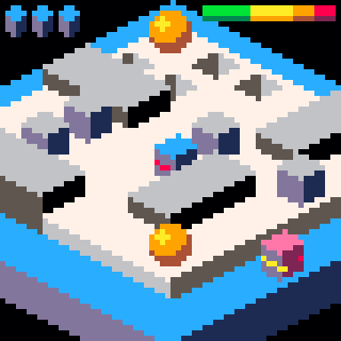

# Bumble Bots
Bumble Bots is a difficult action puzzle game of my own design.
You control a bot which needs to find its way in sixteen small but increasingly more difficult levels.
You need to collect pick ups, push boxes, fill gaps, use teleports and more while being chased by enemy bots or the clock.

The game is developed for the [PICO-8][] fantasy console.

You can play the resulting game online at various web sites:
* [My homepage](https://erwinbonsma.nl/Games/BumbleBots/index.html)
* [PICO-8 BBS](https://www.lexaloffle.com/bbs/?tid=31308)
* [itch.io](https://eriban.itch.io/bumble-bots-lowrez)
* [newgrounds.com](https://www.newgrounds.com/projects/games/1222730)

[PICO-8]: https://www.lexaloffle.com/pico-8.php

